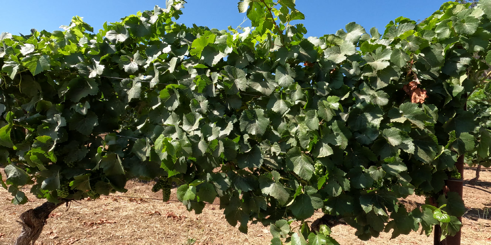
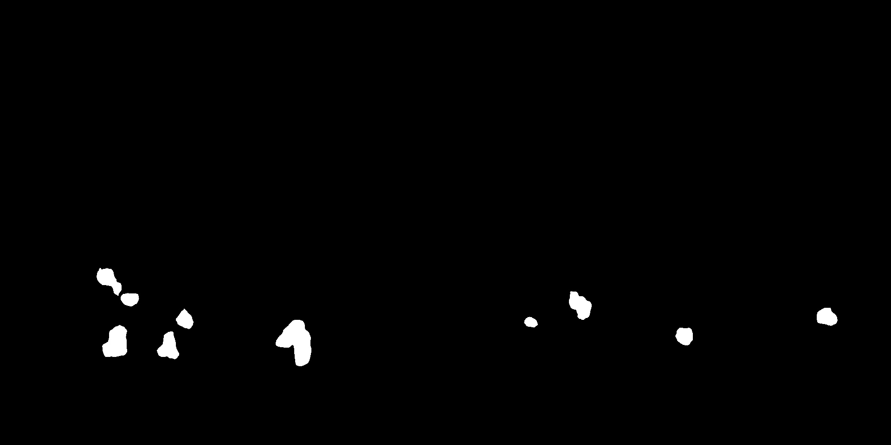

# CS671 Deep Learning Hackathon
## VineNet
This repository is part of the CS671 Deep Learning Hackathon. Participants were tasked with crafting a lightweight, fast deep learning model to precisely segment grape bunches in high-resolution vineyard images.

## Objectives
1. **Model Development:** Build a deep learning model capable of accurately segmenting grape bunches (semantic segmentation) in high-resolution images of vineyards.
2. **Minimize Inference Time:** Emphasize minimizing inference time to enable real-time applications in vineyard management.
3. **Webpage Development:** Develop a user-friendly webpage showcasing the practical application of the segmentation models.

## Model
We trained an end-to-end U-Net architecture to identify bunches of grapes in farm images. The model was trained for *250 epochs*.

## Dataset
A meticulously curated training dataset containing labeled high-resolution images of grape vineyards was provided to participants.

## Features
1. **Less Inference Time:** Optimized for fast inference.
2. **Less Number of Parameters:** Designed with a lightweight architecture.
3. **Simple Architecture:** Easy to understand and implement.

## Results
We achieved a Training IoU of *0.96* and a Validation IoU of *0.71* by the 250th epoch.

Here is a sample image and the mask generated from our model, which will be used to identify grape bunches in the field.

